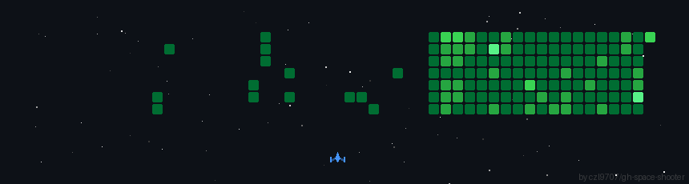

<div align="center">


<h3>Raj &nbsp;·&nbsp; BCA Student &nbsp;·&nbsp; AI/ML Engineer &nbsp;·&nbsp; Cloud & Web Developer</h3>

<br/>

[](https://git.io/typing-svg)

<br/>

[](https://linkedin.com/in/prabhushankar-mund-216a5634a)
[](https://instagram.com/raj___mund)
[](https://x.com/Prabhushan60291)
[](https://discord.gg/AbCd1234)
[](mailto:prabhushankarmund@gmail.com)

<br/>


</div>

---

## 🧑‍💻 About Me

```yaml
name     : Prabhu Shankar Mund  (Raj)
degree   : BCA Undergraduate — Computer Science
location : India 🇮🇳
focus    : AI/ML  ·  Cloud  ·  Web Development  ·  DSA
status   : Open to collaborate & learn
```

- ☁️ Exploring **Cloud platforms** — AWS, Firebase, Vercel & deployment pipelines
- 🤖 Learning **AI & Machine Learning** — from Python fundamentals to model building
- 💻 Building projects with **React, Next.js, Flask & Three.js**
- 🧠 Sharpening **DSA** daily through C++ and Java
- 🌱 Currently diving into **ML pipelines, Flask APIs & cloud-hosted apps**
- ⚡ I go from solving DSA problems to deploying cloud apps in the same evening

---

## 🛠️ Tech Stack

<div align="center">

**Languages**


<br/>

**Frontend**


<br/>

**Backend & Databases**


<br/>

**Cloud & DevOps**


<br/>

**AI / Data Science**


<br/>

**Tools & Design**


</div>

---

## 📈 Learning Roadmap

```text
DSA (C++ / Java)          ██████████░░░░░░  65%  — Active daily practice
Web Dev (React / Next.js) ████████░░░░░░░░  55%  — Building projects
Cloud (AWS / Firebase)    ███████░░░░░░░░░  45%  — Deploying & exploring
AI / ML Foundations       ██████░░░░░░░░░░  40%  — Coursework + experiments
Flask APIs & Backend      █████░░░░░░░░░░░  30%  — Learning + small projects
MLOps & Deployment        ███░░░░░░░░░░░░░  15%  — On the roadmap
```

---

## 🎮 Space Shooter — Gameplay Preview

<p align="center">
  
</p>

<p align="center">
  <a href="https://github.com/Rajmund09/Rajmund09/raw/main/space-shooter.mp4">▶️ Watch full gameplay video</a>
</p>

---

## 📊 GitHub Stats

<div align="center">


<br/><br/>


<br/><br/>


<br/><br/>


</div>

---

## 🤝 Open to Collaborate On

| Area | Details |
|---|---|
| ☁️ **Cloud** | AWS · Firebase · Vercel deployments & pipelines |
| 🌐 **Web Development** | React · Next.js · Node.js full-stack projects |
| 🤖 **AI / ML** | Beginner-to-intermediate experiments & research |
| 🐍 **Python** | Automation scripts, bots, CLI tools |
| 📖 **Open Source** | Beginner-friendly contributions welcome |

---

<div align="center">


*"Combining logic and creativity — one commit at a time."*

</div>
