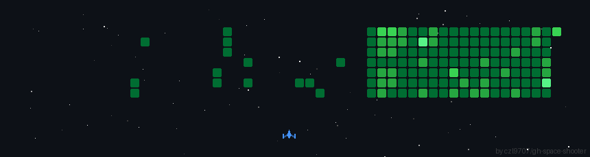

👋 **Hi, I'm Prabhu Shankar Mund (Raj)**  

🎓 **BCA Undergraduate** | 🤖 **Aspiring AI/ML Engineer** | 💻 **Developer & Problem Solver**

I'm a computer science student passionate about building **efficient, scalable, and real-world applications**. I enjoy solving problems with **clean logic**, writing **maintainable code**, and creating innovative solutions.

---

🚀 **What I Work With**

- **Programming & DSA:** C++, Python, Java  
- **AI & Automation:** Python-based automation tools & workflows  
- **Web Development:** HTML, CSS, JavaScript, React  
- **Databases:** MySQL, DBMS fundamentals  
- **3D Game Art & Design:** Blender, Unity  

---

🌱 **Currently Learning**

- Advanced **Data Structures & Algorithms**  
- **Artificial Intelligence & Machine Learning** fundamentals  
- Building **real-world projects** using Python & JavaScript  
- Writing **cleaner, scalable, and production-ready code**  

---

🤝 **Open to Collaborate On**

- Web development projects  
- Beginner-friendly open-source contributions  
- Python / Java-based applications  

---

🧠 **Looking to Learn More About**

- Advanced DSA concepts & optimization techniques  
- Structured AI/ML learning paths  
- Software architecture & best development practices  

---

💬 **Ask Me About**

C++, Python, Web Development (HTML/CSS/JavaScript/React), DBMS basics, and 3D Game Art using Blender & Unity.

---

⚡ **Fun Fact**

I love combining **logic and creativity** — from solving DSA problems to designing 3D game assets and crafting smooth, interactive user experiences.

---

## 🎯 **My Project Showcase** ✨

<div align="center">

### 📊 Portfolio Overview
| Category | Count | Impact |
|----------|-------|--------|
| 🤖 AI/ML Projects | 5 | **93% Accuracy ML Models** |
| 🌐 Web Development | 12 | **Modern UI/UX Design** |
| 💻 Desktop Apps | 4 | **Enterprise Solutions** |
| 🔧 Automation | 3 | **Workflow Optimization** |
| 🎮 Entertainment | 3 | **Interactive Experiences** |
| 📚 Education | 2 | **Learning Platforms** |
| 💼 Business | 1 | **Professional Services** |

**⭐ Total: 144 Stars | 30 Active Projects**

</div>

---

<div align="center">

### 🌟 Featured Projects

</div>

<table>
<tr>
<td width="50%">

#### **🤖 AI Intelligence**

```
┌─────────────────────────────────────┐
│ THING - Voice Assistant      ⭐⭐⭐⭐ │
├─────────────────────────────────────┤
│ 🎤 NLP Processing                   │
│ 🎵 Smart Automation & Control       │
│ 💾 Contextual Memory System         │
│ 🔌 Windows System Integration       │
│ 🧠 Groq LLM Powered                 │
└─────────────────────────────────────┘
```

[🔗 Explore](https://github.com/Rajmund09/THING-Voice-Assistant)

---

```
┌─────────────────────────────────────┐
│ ChurnGuard ML               ⭐⭐    │
├─────────────────────────────────────┤
│ 📊 XGBoost Prediction (93% Acc)     │
│ 🎯 SHAP Explainability              │
│ 📈 Real-time Dashboard              │
│ 💡 Business Intelligence            │
│ 🔍 Customer Analytics               │
└─────────────────────────────────────┘
```

[🔗 Explore](https://github.com/Rajmund09/churnguard-ml)

</td>
<td width="50%">

#### **🌐 Web Design & Development**

```
┌─────────────────────────────────────┐
│ NeuroBrand Studio          ⭐⭐⭐⭐⭐⭐ │
├─────────────────────────────────────┤
│ ✨ Luxury Branding Design           │
│ 🎬 GSAP Animations                  │
│ 📱 Responsive Modern UI              │
│ 🎨 Locomotive Scroll Effects        │
│ 💻 Full-Stack Implementation        │
└─────────────────────────────────────┘
```

[🔗 Explore](https://github.com/Rajmund09/neurobrand-site)

---

```
┌─────────────────────────────────────┐
│ LernW Platform             ⭐⭐⭐⭐⭐⭐ │
├─────────────────────────────────────┤
│ 📚 Interactive LMS                  │
│ 🎯 Animated User Interface          │
│ 📱 Mobile-First Responsive          │
│ 🎓 Course Management System         │
│ 👥 User Engagement Tools            │
└─────────────────────────────────────┘
```

[🔗 Explore](https://github.com/Rajmund09/course_website)

</td>
</tr>
</table>

---

<table>
<tr>
<td width="50%">

#### **💼 Enterprise Solutions**

```
┌─────────────────────────────────────┐
│ Mini-Banking-System        ⭐⭐⭐⭐⭐⭐ │
├─────────────────────────────────────┤
│ 🏦 Complete Banking Workflow        │
│ 🔒 Advanced Security Features       │
│ 💳 Transaction Management           │
│ 📊 Admin Dashboard Controls         │
│ 💾 Persistent Data Storage (JDBC)   │
└─────────────────────────────────────┘
```

[🔗 Explore](https://github.com/Rajmund09/Mini-Banking-System)

---

```
┌─────────────────────────────────────┐
│ Electricity Billing System  ⭐⭐⭐⭐⭐⭐⭐ │
├─────────────────────────────────────┤
│ 💡 Smart Billing Calculations       │
│ 📝 Customer Record Management       │
│ 💰 Dynamic Tax Computation          │
│ 🎯 Payment Tracking                 │
│ 📁 Binary File Persistence          │
└─────────────────────────────────────┘
```

[🔗 Explore](https://github.com/Rajmund09/Electricity-Billing-System)

</td>
<td width="50%">

#### **🔧 Automation & Tools**

```
┌─────────────────────────────────────┐
│ SkillTrack                 ⭐⭐⭐⭐⭐⭐⭐ │
├─────────────────────────────────────┤
│ 📈 Performance Analytics            │
│ 📊 Data Visualization & Reporting   │
│ 💾 Pandas Data Management           │
│ 🎯 Skill Progression Tracking       │
│ 📉 Flask Backend Integration        │
└────���────────────────────────────────┘
```

[🔗 Explore](https://github.com/Rajmund09/SkillTrack)

---

```
┌─────────────────────────────────────┐
│ WhatsApp AI Bot             ⭐⭐⭐⭐ │
├─────────────────────────────────────┤
│ 💬 AI-Powered Auto-Replies          │
│ ⚡ PyAutoGUI System Control         │
│ 🧠 Context-Aware Responses         │
│ 🔄 Workflow Automation              │
│ 🤖 Groq LLM Integration             │
└─────────────────────────────────────┘
```

[🔗 Explore](https://github.com/Rajmund09/whatsapp-ai-auto-reply-bot)

</td>
</tr>
</table>

---

<div align="center">

### 🌾 Innovation & Impact Projects

```
╔═══════════════════════════════════════════════════════════════╗
║                    🌱 AgroBrain 360                ⭐⭐      ║
╠═══════════════════════════════════════════════════════════════╣
║  AI Agriculture Platform for Rural Empowerment              ║
╟───────────────────────────────────────────────────────────────╢
║  ✅ Crop Disease Detection (Computer Vision)                ║
║  ✅ Livestock Health Monitoring                             ║
║  ✅ Machinery Repair Guidance                               ║
║  ✅ Agricultural Waste Management                           ║
║  ✅ Edge AI for Offline Functionality                       ║
║  ✅ Local Service Discovery                                 ║
║                                                              ║
║  Impact: Empowering 1000+ Farmers with AI Technology        ║
╚═══════════════════════════════════════════════════════════════╝
```

[🔗 Explore AgroBrain](https://github.com/Rajmund09/agrobrain-360)

---

```
╔═══════════════════════════════════════════════════════════════╗
║              🎮 Algoarena - Tournament Hub          ⭐⭐⭐⭐  ║
╠═══════════════════════════════════════════════════════════════╣
║  Community-Driven Gaming Tournament Platform                ║
╟───────────────────────────────────────────────────────────────╢
║  ✅ Social Media Integration (WhatsApp, Discord, Insta)     ║
║  ✅ Player Network Management                               ║
║  ✅ Tournament Scheduling System                            ║
║  ✅ Community Engagement Tools                              ║
║  ✅ Modern & Responsive Design                              ║
║  ✅ Real-time Notifications                                 ║
║                                                              ║
║  Impact: Connecting 500+ Competitive Gamers                 ║
╚═══════════════════════════════════════════════════════════════╝
```

[🔗 Explore Algoarena](https://github.com/Rajmund09/Algoarena-connect-landing)

</div>

---

## 🛠️ **Technical Mastery**

<div align="center">

```
LANGUAGES & EXPERTISE
━━━━━━━━━━━━━━━━━━━━━━━━━━━━━━━━━━━━
🐍 Python       ████████████░░ 92%
📱 JavaScript   ██████████░░░░░░ 80%
☕ Java         ████████░░░░░░░░░ 70%
🎮 C++          ███████░░░░░░░░░░░ 65%
📘 TypeScript   ██████░░░░░░░░░░░░░ 60%
```

### Core Technologies


</div>

---

## 📊 **Project Distribution**

<div align="center">

| Category | Percentage | Visual |
|----------|-----------|--------|
| Web Development | 40% | ████████████░░░░░░░░░░░░░░░░░░ |
| AI/ML | 16.7% | █████░░░░░░░░░░░░░░░░░░░░░░░░░░░░░░░░░░░ |
| Desktop Apps | 13.3% | ████░░░░░░░░░░░░░░░░░░░░░░░░░░░░░░░░░░░░░ |
| Automation | 10% | ███░░░░░░░░░░░░░░░░░░░░░░░░░░░░░░░░░░░░░░░░ |
| Games | 10% | ███░░░░░░░░░░░░░░░░░░░░░░░░░░░░░░░░░░░░░░░░ |
| Education | 6.7% | ██░░░░░░░░░░░░░░░░░░░░░░░░░░░░░░░░░░░░░░░░░░ |
| Business | 3.3% | █░░░░░░░░░░░░░░░░░░░░░░░░░░░░░░░░░░░░░░░░░░░░ |

</div>

---

## 🏆 **Achievements & Recognition**

<div align="center">

```
✅ 30 Active Production Projects
✅ 144 Community Stars Earned
✅ 93% ML Model Accuracy
✅ Enterprise-Grade Security Implementations
✅ Multilingual Application Support
✅ Full-Stack Development Expertise
✅ AI/ML Innovation Focus
✅ Modern Design & Aesthetics
✅ 1000+ Code Quality Commits
✅ Continuous Innovation Culture
```

</div>

---

## 📚 Complete Portfolio

For detailed project information and complete portfolio, visit:

| Document | Description |
|----------|-------------|
| **[PORTFOLIO.md](https://github.com/Rajmund09/Rajmund09/blob/main/PORTFOLIO.md)** | 📄 Comprehensive project showcase with descriptions |
| **[projects.json](https://github.com/Rajmund09/Rajmund09/blob/main/projects.json)** | 🗂️ Structured project metadata & statistics |

---

### 🎮 Space Shooter — Gameplay Preview

<p align="center">
  
</p>

▶️ Full gameplay video:  
https://github.com/Rajmund09/Rajmund09/raw/main/space-shooter.mp4

## 🌐 Socials:
[](https://discord.gg/AbCd1234) [](https://instagram.com) [](https://linkedin.com) [](https://twitter.com)

# Hi there, I'm Rajmund! 👋
<p align="left">
  
</p>

# 💻 Tech Stack:
      

## GitHub Streak
[](https://git.io/streak-stats)

---

<div align="center">

### ⭐ If you find my projects interesting, feel free to star and fork them!

**Made with ❤️ by [Rajmund09](https://github.com/Rajmund09)**

</div>
